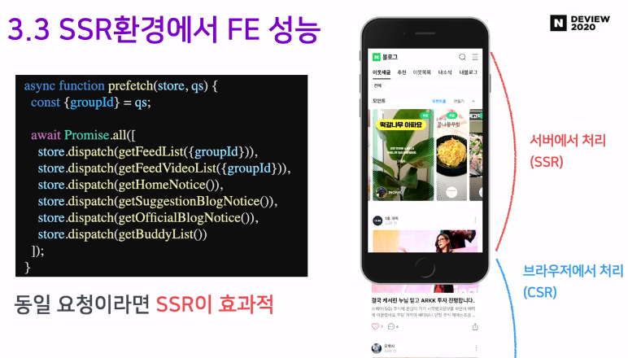
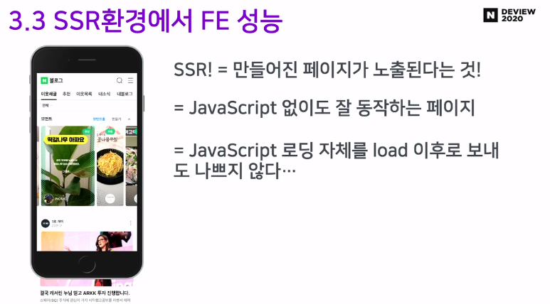
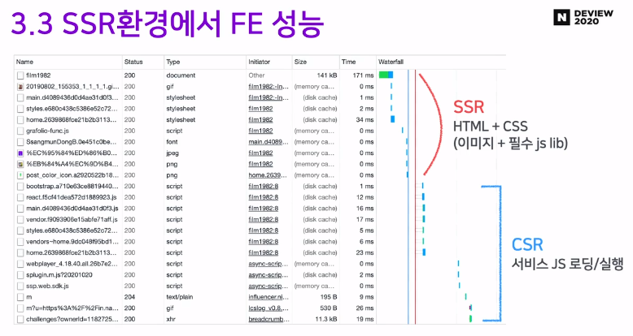
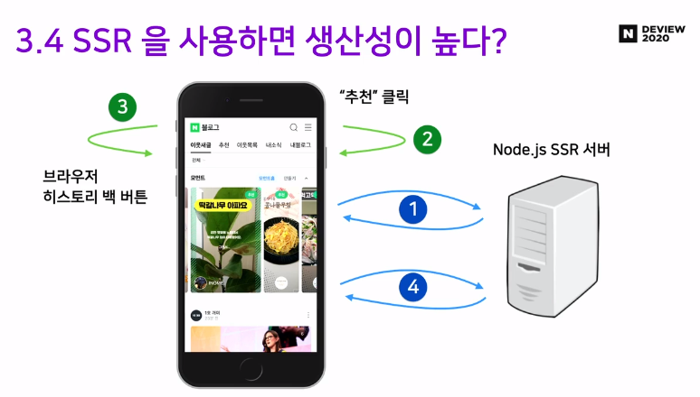
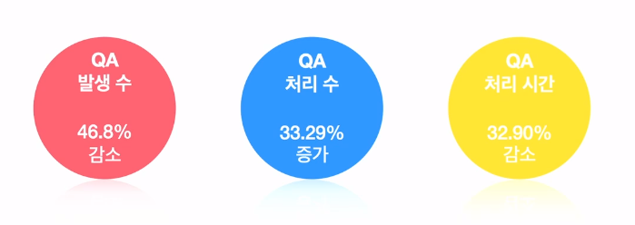
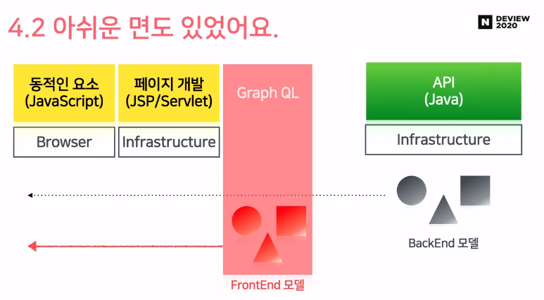
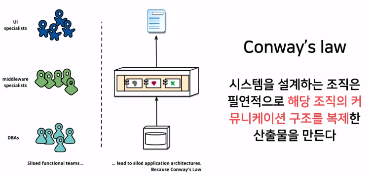

# 어서와, SSR은 처음이지?

**(네이버 블로그 Node.js 기반의 Server-Side Rendering 적용기)**

[:scroll:동영상 URL](https://tv.naver.com/v/16970015?query=DEVIEW2020&plClips=false:16970966:16971193:16970962:16970571:16970002:16971182:16971189:16971192:16972084:16972095:16971868:16970970:16972091:16969169:16971174:16971290:16972093:16970573:16971854:16971183:16971190:16971859:16971206:16971188:16970960:16968210:16970751:16969155:16971874:16800287:16968266:16969166:16969158:16971856:16971330:16971288:16970015:16969998:16863690:16970759)

---

* 2.2 개발 환경은 어떻게 선정했나?

  Next.js에 대해 고민했지만 전국민에게 서비스하는 곳으로서 알 수 없는 블랙 박스를 두는 것과 같다고 생각해서  자체 구축하기로 결정

  

---

## 메모리 누수 문제에 대해서

## 메모리 누수 해결하기

=> 정상적으로는 이전 힙에 메모리가 안남아서 전부 회색이 되는 것이 정상!

=> 메모리 누수가 일오나고 있다면 다음과 같은 모습을 띄게 된다.

=> 영역을 잡아서 많이 차지하거나 살아있는 목록을 확인해서 추적해 나간다.

---

## 실제 SSR의 FE 설능

=> SSR의 페이지 전체 로딩이 되고 난 뒤 나머지 동적인 요소들이 부여되고 만들어져가는 과정, CSR의 경우 각각의 요소들이 차근차근 클라이언트 측에서 렌더링이 되면서 만들어 지는 과정을 볼 수 있다.

=> SSR 적용을 했더니 First Paint는 감소하였으나, DomContentLoaded Time이 증가한 것을 볼 수 있다.

* First Paint : Paint Timing API의 부분으로 네비게이션이 시작하고 스크린에 첫 픽셀이 렌더링 되기 까지의 시간을 뜻한다. [링크](https://developer.mozilla.org/en-US/docs/Glossary/First_paint) , [참조할만한 링크](https://developer.mozilla.org/en-US/docs/Mozilla/Add-ons/WebExtensions/API/webNavigation)

1. 서버로 요청이 날아간다.(1번 시작)
2. 서버에서 HTML을 만들어서 브라우저에 병렬적으로 전달
3. 모든 HTML을 받게 되면(= componentDidMount) 리액트가 활성화 된다.(2번 시작)

=> SSR 타임이 늘어나는 것은 TTFB의 영향이 있다. 구체적으로 살펴보면

=> 뷰포트 내에 있는 것들은 SSR로 그 아래 컴포넌트는 CSR로 처리하지만 **만약 동일 요청을 조절한다면(?) SSR이 효과적이다**

=> 실제 적용한 워터폴을 아래에서 확인해보자

=> 다음과 같은 순서로 실행되는 것을 볼 수 있다.

1. SSR - 처음 페이지 요청
2. CSR - 추천 클릭
3. CSR - 뒤로 가기 버튼
4. SSR - 새로 고침

---

## 4. 적용 후기

* 동료들의 피드백

​	

* 정량적인 데이터

* 아쉬운 면

=> 백엔드에서 만든 모델이 프론트까지 바로 와서 프론트가 백에 종속적이게 되고 UI같은 것을 건드릴 때 바꾸거나 하는 요청이 생기게 된다. 이것을 해결하고자 고민하고 있는 포인트가 **Graph QL Layer의 도입**이다. 백엔드에서 온 데이터 모델을 Graph QL로 정렬을 하고 정렬을 한 데이터를 프론트로 쏨으로써 조금 더 생산성을 높일 수 있을거라 판단하고 있다.

 Q. 저희도 도입하면 비슷한 결과를 얻을 수 있을까요?

 A.

=> 라는 답을 주셨는데 실제로 겪어봐야 알 것 같다..!